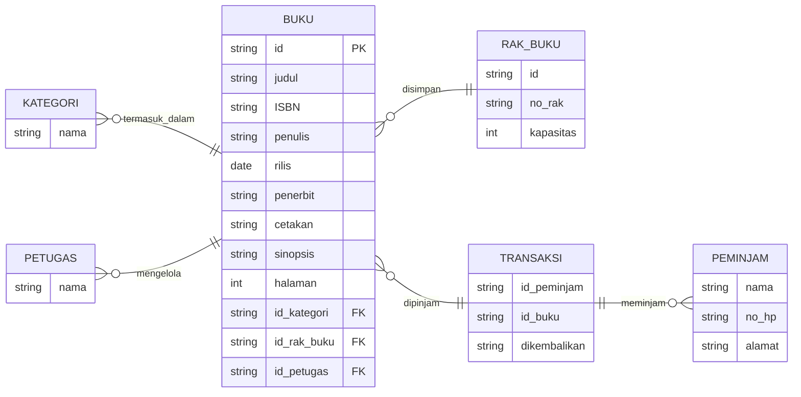

```mermaid
erDiagram
  direction rl
  BUKU ||--o{ KATEGORI : termasuk_dalam
  RAK_BUKU ||--o{ BUKU: disimpan
  BUKU ||--o{ PETUGAS: mengelola
  PEMINJAM }o--|| TRANSAKSI: meminjam
  TRANSAKSI ||--o{ BUKU: dipinjam
  
  BUKU {
    string    id            PK
    string    judul
    string    ISBN
    string    penulis
    date      rilis
    string    penerbit
    string    cetakan
    string    sinopsis
    int       halaman
    string    id_kategori   FK
    string    id_rak_buku   FK
    string    id_petugas    FK
  }
  KATEGORI {
    string    nama
  }
  
  RAK_BUKU{
    string    id
    string    no_rak
    int       kapasitas
  }

  PETUGAS {
    string    nama
  }

  PEMINJAM {
    string    nama
    string    no_hp
    string    alamat
  }

  TRANSAKSI {
    string    id_peminjam
    string    id_buku
    string    dikembalikan
  }

```