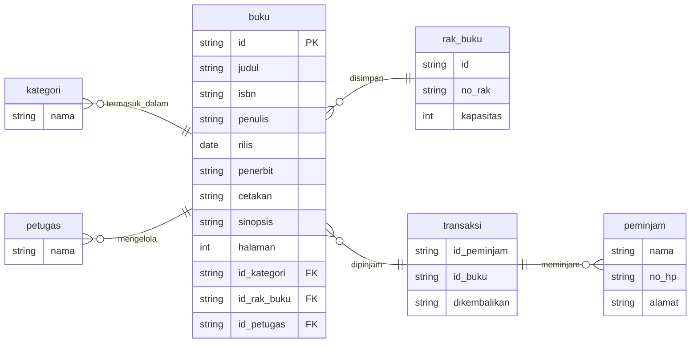

```mermaid
erDiagram
  direction rl
  buku ||--o{ kategori : termasuk_dalam
  rak_buku ||--o{ buku: disimpan
  buku ||--o{ petugas: mengelola
  peminjam }o--|| transaksi: meminjam
  transaksi ||--o{ buku: dipinjam
  
  buku {
    string    id            PK
    string    judul
    string    isbn
    string    penulis
    date      rilis
    string    penerbit
    string    cetakan
    string    sinopsis
    int       halaman
    string    id_kategori   FK
    string    id_rak_buku   FK
    string    id_petugas    FK
  }
  kategori {
    string    nama
  }
  
  rak_buku{
    string    id
    string    no_rak
    int       kapasitas
  }

  petugas {
    string    nama
  }

  peminjam {
    string    nama
    string    no_hp
    string    alamat
  }

  transaksi {
    string    id_peminjam
    string    id_buku
    string    dikembalikan
  }

```